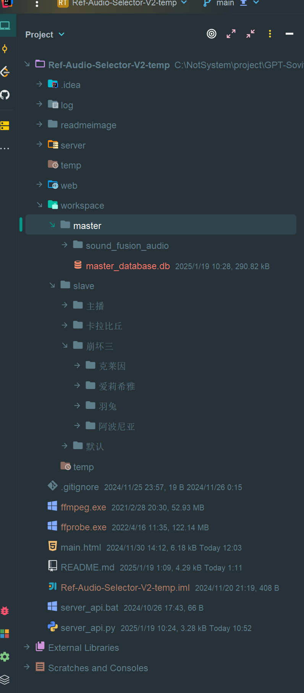

# RefAudioSelectorV2-BaseOn-GptSoVits
# RefAudioSelectorV2说明

1. 为什么开发这个项目

   去年五一的时候发布了一个v1版本，用来简化参考音频的筛选。但是那个功能做的比较粗糙，在后面做崩坏三第一部模型训练的过程中，发现了很多不足之处，所以基于当时的体验，我设计了这个v2版本，进一步降低筛选参考音频的时间成本。
2. 项目有什么亮点
    1. 对参考音频做了集中管理，无论是后续做人工校准，还是切换参考音频，都很方便

       
    2. 添加更全面的参数对比，除了参考音频对比，还添加了Gpt模型、SoVits模型、topK、topP、temperature、文本分隔符、音频语速、融合音频等单变量对比，以及 组合模型、kpt三参数等多变量对比

       
    3. 结果音频按时长排序，不同参考音频对模型推理的语速效果是存在影响的，根据推理结果音频的排序，可以快速确定一批需要重点关注的音频对象

       
    4. 音频结果可视化，添加结果音频频谱图，可以直观的发现大段电音、复读、吞句、以及频繁换气之类的问题，减轻耳朵的负担

       
    5. 提供了结果音频打分功能，可以记录自己对此推理结果的评分，便于后续筛选
    6. 音频分类，对于参考音频片段多的角色，比如一千以上的参考音频片段，提供了基于阿里的说话识别模型，进行音频分类的功能

       
    7. 参考音频切分，对于10s以上的参考音频，以及整体不错，但是存在部分瑕疵，需要微调的参考音频，可以利用音频切分功能进行拆分

       
3. 主体流程
    1. 下载整合包：
       通过百度网盘分享的文件：RAS2整合包
       链接：https://pan.baidu.com/s/1R-T_1y1Nyqbq8pBaHxk9Cw?pwd=i8ep
       提取码：i8ep
       此整合包，内嵌了fasterwhisper-large-v3模型，所以体积较大
    2. 解压后，在RefAudioSelectorV2-BaseOn-GptSoVits目录下，双击server\_api.bat文件启动项目
    3. 按照【分类-名称】创建角色，比如，男性-张三

       
    4. 将GptSoVits模型生成的list文件导入到本系统中

       
    5. （可选）对导入的参考音频进行分类

       

       

       

       

       
    6. 创建基于参考音频参数的对比任务

       

       
    7. 推理结果音频

       
    8. 在结果评测界面依次评测音频，并打分

       

       
    9. 在长文测试环节，挑选最高评分音频进行测试并打分

       

       

       

       

       
    10. 将最符合期望的音频放入成品管理

        

        
    11. 如果没有找到合适的参考音频，可以前往推理任务界面调整对比参数，比如降低Gpt模型轮数，重新启动流程。
    12. 如果绝大部分结果音频的质量都非常糟糕，应考虑寻找更高质量的基础音频重新训练模型
    13. 如果发现某个参考音频非常契合期望，但是存在部分瑕疵，可以对此音频进行分割，挑选子音频进行推理测试，或许能找到更完美的推理结果

        
4. 技术结构
    1. 以SQLite作为数据库
    2. 用layui设计前端界面
    3. 后端采用python
    4. 依赖GptSoVits项目和其运行环境
    5. 对GptSoVits项目的少部分代码做了调整，主要是切换模型加载的路径（我将GSV项目的工作目录切换到了本项目下，因此GSV模型加载路径需要调整），以及处理一个阿里说话人识别模型在windows环境下运行存在的兼容性问题
        1. 找GptSoVits项目下的GPT\_SoVITS/text/chinese2.py文件，用下面这段代码，替换掉原第三十行的g2pw模型加载代码。

           model\_dir = os.environ.get( &#x20;

           "g2pw\_model\_dir", "GPT\_SoVITS/text/G2PWModel" &#x20;

           ) &#x20;

           model\_source = os.environ.get( &#x20;

           "g2pw\_model\_source", "GPT\_SoVITS/pretrained\_models/chinese-roberta-wwm-ext-large" &#x20;

           ) &#x20;

           g2pw = G2PWPinyin(model\_dir=model\_dir,model\_source=model\_source,v\_to\_u=False, neutral\_tone\_with\_five=True)

           
        2. windows不支持torchaudio\_extension中的sox，百度到的解决办法

           修改GptSoVits的runtime\lib\site-packages\modelscope\pipelines\audio\speaker\_verification\_light\_pipeline.py中的类 SpeakerVerificationPipeline中函数preprocess下的

           data, fs = torchaudio.sox\_effects.apply\_effects\_tensor(

           data,

           fs,

           effects=\[\[

           'rate',

           str(self.model\_config\['sample\_rate'])

           ]])

           为

           resampler = torchaudio.transforms.Resample(orig\_freq=fs, new\_freq=self.model\_config\['sample\_rate'])

           data = resampler(data)

           
    6. 文件存储结构，分为主库和分库两部分，主库存放推理文本等公用内容，分库则各自存放不同角色的数据，如果需要删除某个角色，直接在分库删除此角色目录即可

       
5. 潜在问题
    1. 在执行推理任务时，为了加快推理速度，添加了多进程推理，但是会遇到一些偶发问题，比如GPU占用100%但是任务没有推进；或者直接闪退，没有任何错误信息。这些在多进程并发推理时，有时会发生有时不会，保险起见，我默认只设置了推理进程为1。如果要加速的，就提高推理进程数，但更容易遇到上面的问题

       
